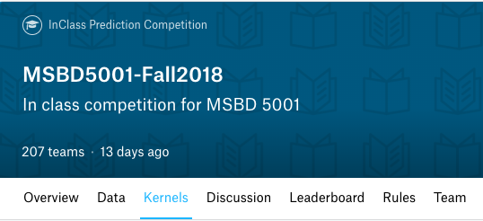

# 5001_Kaggle
5001 MSBD Kaggle Code Submission

This is code submission for the Kaggle competition that can be found here: https://www.kaggle.com/c/msbd5001-fall2018/

I tried multiple methods like normal linear regression, MLP regressor and Tensor Flow to tune my test results.

The score that lead me to the highest score has been uploaded for individual assignment grading purposes.

Problem Definition
Our problem is related to analyzing the performance of computer programs: We randomly generated datasets and models to train classification models. Your goal is to predict how long the program takes (testing data).

Expected Output
Test data that is in line with what was generated (beyond the 400 rows) that closely resembles (in terms of accuracy) to the test data with the supervisors.

Results, Accuracy and Predictions
Smaller error leads to high ranking, graded and generated by Kaggle. By the end of competition you can select a solution for final grading, by default it’s the one with best public leaderboard score. This is graded with private leaderboard.

Packages Used:
import os
import pandas as pd
import numpy as np
import matplotlib.pyplot as plt
import numpy as np
import seaborn as sns
import tensorflow as tf
from sklearn.model_selection import train_test_split

Import CSV's into data frame

test_data = pd.read_csv("./input/test.csv")
train_data_new = pd.read_csv("./input/train.csv")
train_data_old = pd.read_csv("./input/train_old.csv")

Remaining comments and code is in 'Kaggle_Final_Week_GH.ipynb'

---------------------//---------------------
ITSC Username : aparyani
Kaggle Team Name: aparyani
